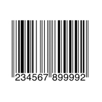

## Codes

### What is this app made for?

Codes iOS application is designed to help in scanning Barcodes and QR codes of various formats. It also allows to generate QR codes and scan stored images.

### What are these Bar and QR codes?

A barcode is a square or rectangular image consisting of a series of parallel black lines and white spaces of varying widths that can be read by a scanner. Barcodes are applied to products as a means of quick identification. They are used in retail stores as part of the purchase process, in warehouses to track inventory, and on invoices to assist in accounting, among many other uses.

A QR code (abbreviated from Quick Response code) is a two-dimensional matrix code capable to encode more information than a regular barcode. QR codes applications include product tracking, item identification, time tracking, document management, and general marketing.

### Where do I find these codes?

Bar codes could be found in almost any store as they are widely used to encode information about products prices. QR Codes are not as common and could be sometimes found in restaurants, airports, hotels, public transport, magazines, signs, business cards, etc.

### How Do I scan?

To read a Bar or QR code with Codes app simply open 'Live Scan' screen and point camera at the code image you're about to scan.

### What formats are supported?
Codes app supports various 1d and 2d codes formats, including the following:

* QR
* Code39
* Code39Mod43
* Code93
* Code128
* UPCE
* EAN
* ISBN
* ISSN
* ITF
* Interleaved2of5
* DataMatrix
* PDF417
* Aztec

### I can't scan a specific code. Why?

Make sure you're holding your device right in front of code and nothing obstructs the viewport. Turn on the flash if you're in a dark place. Also check if you're scanning one of the supported codes formats. 

### I want to create an QR code.

To generate a QR code from your data from the main screen press the 'Generate Code' button, type your information in the next window and hit 'Generate' button. You can optionally save the generated code to your photos gallery.

### I have an image of a code stored in my photo library. Can I scan it?

Yes, you can scan any image in your photos library with Codes application. Just hit the 'Scan Photo Library' button from the main screen and follow instructions on the next page.

### How can I see previously scanned codes?

You can browse and manipulate your scans history from History screen. 

### I have another question.

Feel free to contact us at support@codesapplication.com

